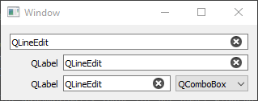

# entryWidget
Data entry PyQt5 QWidget subclasses, for error checking convenience and automatic colors.

## Classes:
    
    AutoColorLineEdit  # QLineEdit with automatic colors
    LabelLineEdit  # AutoColorLineEdit with a QLabel on left side
    EntryWidget  # LabelLineEdit with QComboBox on right side
    

## doc strings:

#### AutoColorLineEdit
    A QWidget subclass, with delegated functions from a QLineEdit (at ._editBox)
    
    Change text with obj.setText('new entry text')
    Read text with obj.text()
    Set/unset ReadOnly with obj.setReadOnly(bool)
    Set/unset Enabled with obj.setEnabled(bool)
    
    Change automatic colors with obj.setAutoColors( color_dict )
    Set widget to use stored automatic colors with obj.setAutoColors()
    Manually change colors with obj.setColors( color_tuple )
    Set widget to use manual colors with obj.setColors()
        
    See help(setColors) and help(setAutoColors) for color_dict and color_tuple formats.
    
    Extended functionality:
        Attached callbacks will be automatically called upon different events.
        When called, the functions are passed the calling instance.
        Callbacks can be set by __init__ or by set* methods:
            setIsError, setOnError, setOnTextChanged, setOnEditingFinished
    
        See help(__init__) for more info on callbacks.
        
#### LabelLineEdit
    An AutoColorLineEdit subclass with additional QLabel.
    
    Change label text with obj.setLabel('new text')
    Read label text with obj.getLabel()

    Extended functionality:
        Attached callbacks can be automatically called upon different events.
        When called, the functions are passed the calling instance.
        Callbacks can be set by __init__ or by set* methods:
            setOnLabelClick

        See help(__init__) for more info on callbacks.
        
#### EntryWidget
    A LabelLineEdit subclass with additional QComboBox.
    
    Set available options with obj.setOptions(['opt1', 'opt2', 'op3'])
    Get available options with obj.getOptions()
    Set current selection with obj.setSelected('opt2')
    Get current selection with obj.getSelected()
    Set/unset ReadOnly with obj.setOptionFixed(bool)
    
    Extended functionality:
        Attached callbacks can be automatically called upon different events.
        When called, the functions are passed the calling instance.
        Callbacks can be set by __init__ or by set* methods:
            setOnOptionChanged

        See help(__init__) for more info on callbacks.
        